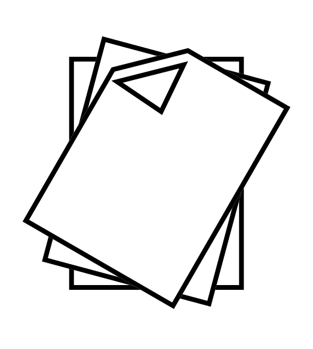
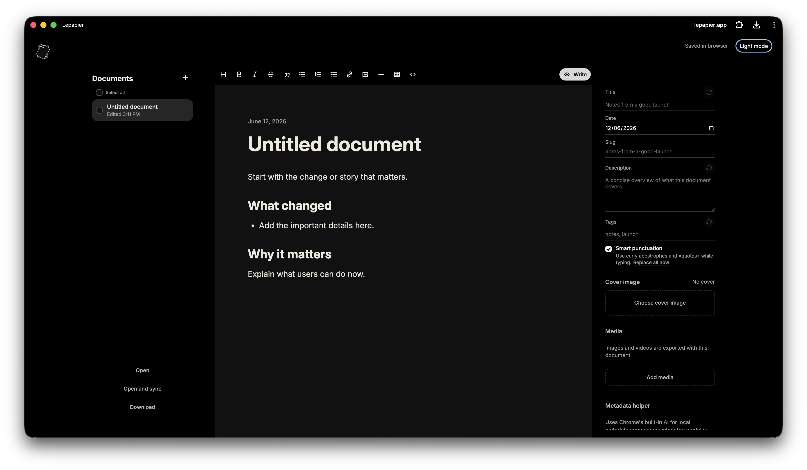
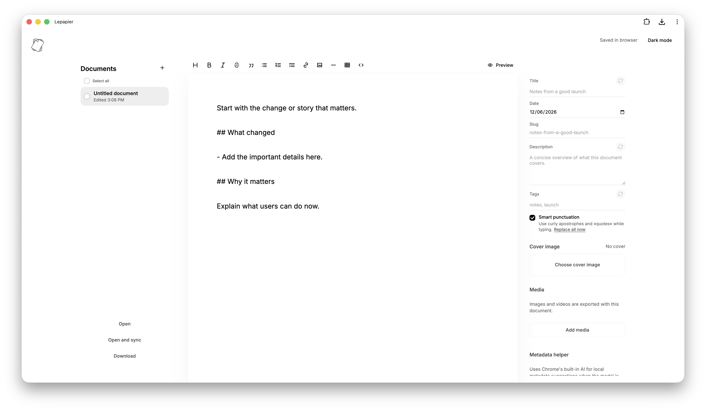

<p align="left">
  <picture>
    <source media="(prefers-color-scheme: dark)" srcset="public/assets/icons/lepapier-dark.svg">
    
  </picture>
</p>

# Lepapier.app

<p>
  
  <a href="https://github.com/chatenhancer/lepapier/actions/workflows/ci.yml"></a>
  
  <a href="LICENSE"></a>
</p>

Lepapier (from French: le papier, "the paper") is a local-first Markdown writing app for drafting, editing, previewing, and exporting documents from the browser.

It is designed to serve as a quiet writing surface with the least distractions possible, while still handling the practical parts of publishing: frontmatter, media, Markdown previews, preview editing, drafts, importing and exporting, syncing with local files, and portability.

It builds into a single `index.html` file that can be placed and opened anywhere.

[Website](https://lepapier.app) · [Start writing](https://lepapier.app/editor/) · [Releases](https://github.com/chatenhancer/lepapier/releases)

## What’s it good for?

It was mainly developed to cleanly create, edit, and export Markdown archives for static *Astro* sites and blogs, but it can be used to edit any form of Markdown content.

**Please note that the app is unfinished**. For now it only has the features I need to publish content on blogs like https://chatenhancer.com, which are _Astro_ sites. 

Feature set and robustness will improve in the future as I go along.

## Features (unfinished)

- Local-first editing with drafts saved in the browser.
- Multi-document workspace with document selection, bulk download, and bulk removal.
- Open a Markdown file or a folder of Markdown files.
- Open and sync a Markdown file or folder using the File System Access API where supported.
- Import referenced media assets from opened folders.
- Add cover images plus document images and videos, then export them with Markdown.
- Download one document as `.md` when no assets are needed, or export documents and assets as a `.zip`.
- Live Markdown preview with editable text, table cells, image controls, and playable videos.
- Frontmatter fields for title, date, slug, description, tags, and cover image.
- Optional manual Chrome built-in AI metadata refresh buttons for title, description, and tags.
- Smart punctuation and media filename randomization options.
- PWA-ready standalone app built with Vite and vanilla DOM APIs.

## Editing workflow

Lepapier has two main modes:

- **Write** is the source Markdown editor. Toolbar actions insert Markdown at the current caret and scroll to the insertion point.
- **Preview** renders the document and lets you edit many parts in place. Preview edits write back to the Markdown source.

Preview mode currently supports editing:

- Body text, headings, quotes, list items, title, description, and tags.
- Table cells, with controls for adding rows and columns.
- Images, including resize, alignment, crop, rotation, inline display, shadow, replacement, side text, and removal.
- Videos as playable media in preview and exported bundles.

## Markdown support

The renderer supports the Markdown used by the editor workflows:

- Headings, paragraphs, blockquotes, links, inline code, fenced code, bold, italic, and strikethrough.
- Unordered lists, ordered lists, task lists, and horizontal rules.
- Tables with alignment markers and editable preview cells.
- Markdown images with app-specific attributes for width, alignment, crop, focus, rotation, display, shadow, and media side text.
- Video references rendered as playable media.

## Media and assets

Cover images and document media are handled separately:

- The cover image maps to the frontmatter image field.
- The Media sidebar is a workspace asset shelf. It shows images and videos available to insert, download, and export.
- Markdown media paths are resolved against the cover image and the workspace media shelf.
- Imported folders reuse shared referenced media files instead of creating a separate copy for every Markdown document.

## Privacy

- Drafts and settings stay in browser storage.
- Media files and editable file/folder handles are stored locally in IndexedDB where available.
- Files opened through the File System Access API stay local to your browser session and granted handles.
- Metadata suggestions use Chrome's built-in AI when available. After Chrome installs the model, metadata suggestions run locally.
- App updates are surfaced as a reload prompt instead of forcing a refresh while you are writing.

## Current limits

- The app is unfinished and currently follows the author's static-site publishing workflow first.
- Editable file and folder syncing depends on browser support for the File System Access API.
- Browser storage can be cleared by the browser or user, so exported Markdown and zip files are still the durable copy.
- The landing/docs site is deployed at `https://lepapier.app/`; the tagged editor build is deployed at `https://lepapier.app/editor/`.

## Screenshots

### Dark mode



### Light mode




## Development

Install dependencies:

```sh
npm install
```

Start the local dev server:

```sh
npm run dev
```

Run TypeScript checks:

```sh
npm run check
```

Run tests:

```sh
npm test
```

Build for production:

```sh
npm run build
```

Preview the production build:

```sh
npm run preview
```

Run the landing/docs site and editor together:

```sh
npm run docs:dev
```

Build the GitHub Pages artifact:

```sh
npm run pages:build
```

## Release

1. Run `npm run version:bump -- patch`, `npm run version:bump -- minor`, or `npm run version:bump -- major`.
2. Run `npm run verify`.
3. Commit the version bump.
4. Run `npm run release:tag`.

The release workflow validates exact `vX.Y.Z` tags against `package.json`, creates the release zip, attaches it to a GitHub Release, and deploys the tagged app to `https://lepapier.app/editor/`.

## Architecture

- `Vite` serves and bundles the standalone app.

- The editor is a vanilla DOM app with direct access to browser-native APIs: IndexedDB, File System Access, clipboard media, PWA support, and Chrome built-in AI.

- Draft text is saved in `localStorage`; selected media files and editable file/folder handles are saved in IndexedDB.

- Exports are generated client-side as Markdown files or zip archives depending on selected documents and referenced assets.

## License

GPL-3.0-or-later. See [LICENSE](LICENSE).
